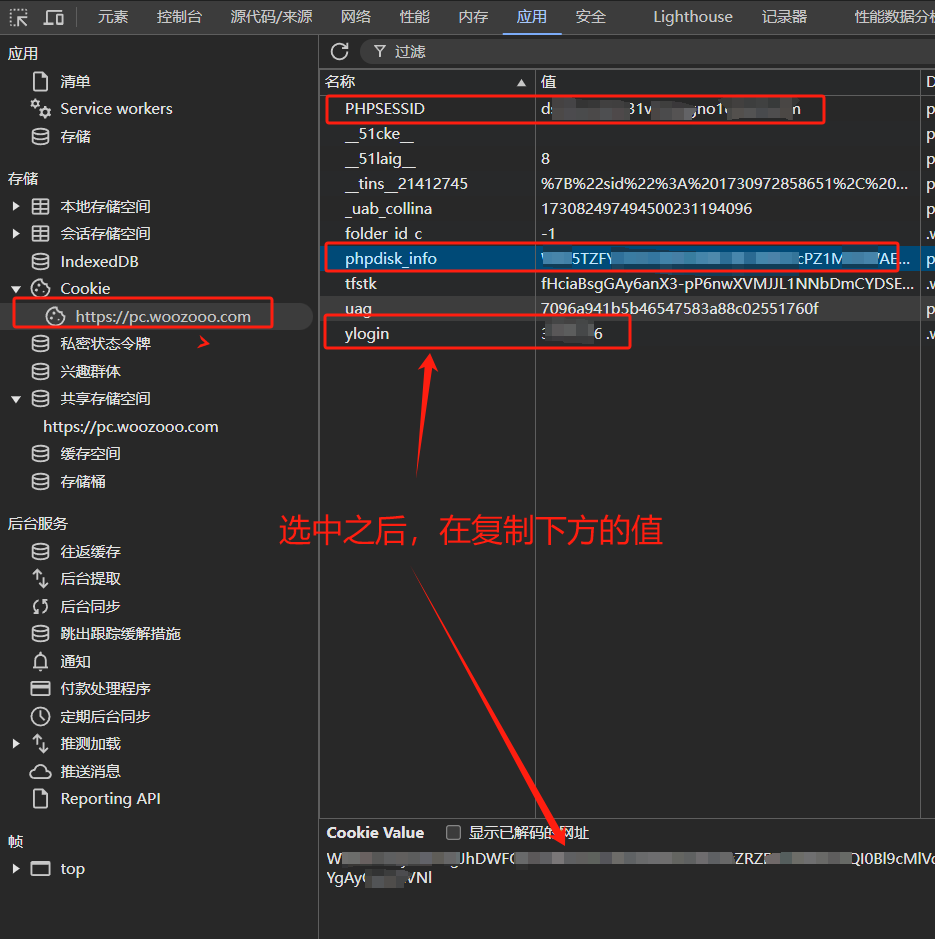

# 蓝奏云API逆向

蓝奏云是一个很小众的网盘工具，少有的不对存储总量和下载速度作限制的网盘。

这个Python包实现对文件的上传、分享、设置密码、获取下载直链等功能。

使用方式：

- 网址登陆，获取三个cookie信息：`PHPSESSID` 、`phpdisk_info`、 `ylogin`；



- 导入`LanZouApi` 和 `LanZouCookie` 两个类，传入获取到的cookie，进行实例化；

```python
from zibuyu_lanzou import LanZouApi, LanZouCookie

cookie = LanZouCookie(
	PHPSESSID="xxx",
	ylogin="xxx",
	phpdisk_info="xxx",
)

handler = LanZouApi(cookie)
```


